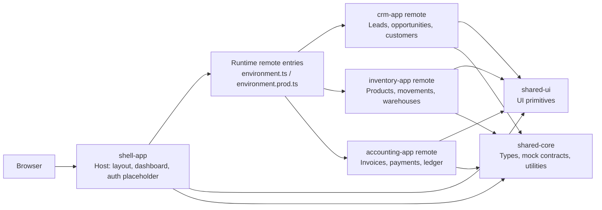

# Angular 21 ERP/CRM Micro-Frontends

Author: Anand Potta

A production-grade Angular 21 micro-frontend boilerplate for an ERP/CRM case study inspired by modular business platforms. The repo is intentionally front-end only: mock data, standalone components, route-based Native Federation, and GitHub Pages deployment are included; backend and Java microservice integration are reserved for a future article.


## What Is Included

- `shell-app`: host layout, navigation, dashboard, auth placeholder, remote fallback UI, and runtime remote loading.
- `crm-app`: leads, opportunities, customers, and a pipeline board placeholder.
- `inventory-app`: products, stock movements, warehouses, and reorder indicators.
- `accounting-app`: invoices, payments, and ledger placeholder.
- `shared-ui`: reusable buttons, cards, badges, data table, sidebar, and topbar primitives.
- `shared-core`: typed data contracts, mock ERP/CRM data, route metadata, and utilities.
- GitHub Actions build validation and GitHub Pages deployment.

## Architecture



## Prerequisites

Use a Node version supported by Angular 21:

```bash
nvm use
npm ci
```

The repo includes `.nvmrc` and `.node-version` set to Node `22.12.0`.

## Local Development

Open four terminals:

```bash
npm run start:crm
npm run start:inventory
npm run start:accounting
npm run start:shell
```

Default local ports:

| App | URL |
| --- | --- |
| Shell | `http://localhost:4200` |
| CRM remote | `http://localhost:4201` |
| Inventory remote | `http://localhost:4202` |
| Accounting remote | `http://localhost:4203` |

If port `4200` is busy, run:

```bash
npx ng serve shell-app --port 4300
```

## Build And Test

```bash
npm run build:libs
npm run build:all
npm run test:ci
```

`build:all` builds shared libraries first, then CRM, Inventory, Accounting, and the shell.

## GitHub Pages Deployment

The Pages build places the shell at the repository root and remotes under `/remotes/*`:

```bash
npm run build:gh-pages
```

Output:

```text
dist/github-pages/
  index.html
  404.html
  remotes/
    crm/
    inventory/
    accounting/
```

If the repo name changes, update:

- `repoName` in `environment.prod.ts`
- `baseHref` and `deployUrl` values in `angular.json`
- README and article links


```bash
npm run deploy:gh-pages
```

## Screenshots

TODO: add screenshots after publishing the demo.

- Shell dashboard
- CRM leads
- Inventory products
- Accounting invoices
- Remote fallback state

## Next: Java Microservices

Future articles can add a Java API gateway, Spring Boot services per business capability, identity provider integration, real permissions, and remote data adapters. This repo deliberately avoids backend code so the micro-frontend architecture remains clear.
# angular-erp-crm-mfe-main
